<div align="center">


<h3>Your personal 3D model library.</h3>

<p>
Collect, organize, preview, and manage your 3D printing models<br>
from the places where you discover them.
</p>

<p>
  
  
  
  
  <a href="https://github.com/sponsors/TautvydasDerzinskas"></a>
  <a href="https://buymeacoffee.com/TautvydasDerzinskas"></a>
</p>

</div>

## About

If you do 3D printing, you probably discover models across **MakerWorld, Printables, Thingiverse, and other 3D model platforms**.

Over time, those bookmarks, downloads, ZIP files, and random folders become a mess.

**Thingport is your personal, self-hosted 3D model library.**

Bring your models together in one place, keep them organized, and preview them directly in your browser.

Instead of having your collection scattered across different websites and your filesystem, Thingport gives you a single place to manage the models you actually want to keep.

## Features

- 🗂️ **Personal model library** — keep your 3D models in one organized place
- 🌐 **Import from model websites** — bring models into your library from supported platforms
- 🔎 **Search & organize** — find models in your collection quickly
- 🧊 **3D previews** — inspect models directly in the browser
- 📦 **Archive your models** — keep local copies of the models you want to preserve
- 🖼️ **Model metadata & previews** — keep useful information together with the files
- 🔗 **Source links** — retain the original model source
- 🐳 **Self-hosted** — run your own instance and keep your collection under your control
- 🌍 **Multi-language ready** — internationalization support built into the frontend
- ⚡ **Modern web interface** — React + Three.js powered UI

## Screenshots

<table>
  <tr>
    <td width="33%"><a href="frontend/src/assets/screenshots/01_dashboard.png" target="_blank">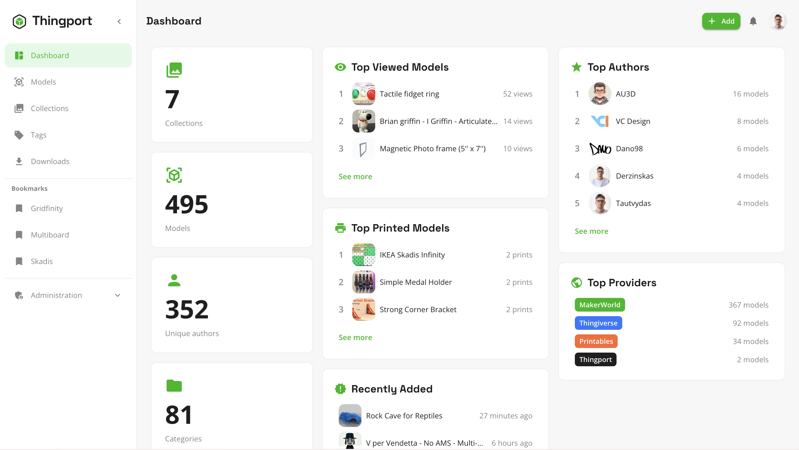</a><br><sub><b>Dashboard</b></sub></td>
    <td width="33%"><a href="frontend/src/assets/screenshots/02_models.png" target="_blank">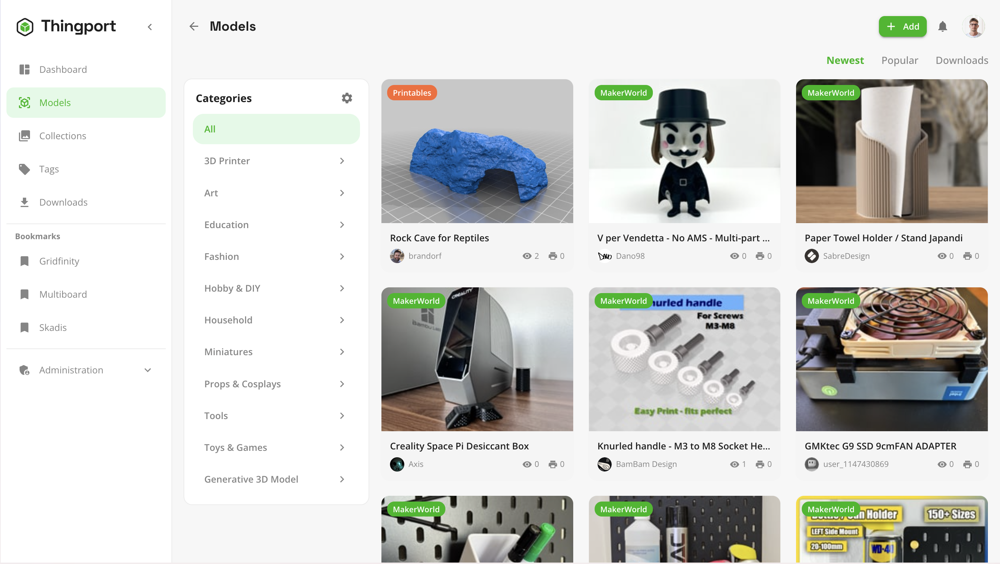</a><br><sub><b>Models</b></sub></td>
    <td width="33%"><a href="frontend/src/assets/screenshots/03_model_details.png" target="_blank">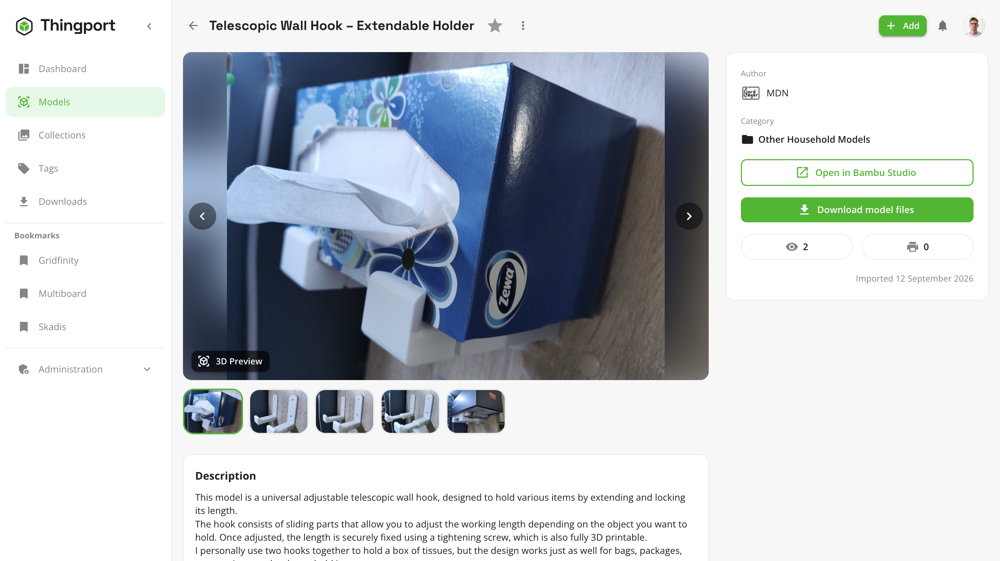</a><br><sub><b>Model Details</b></sub></td>
  </tr>
  <tr>
    <td width="33%"><a href="frontend/src/assets/screenshots/04_model_details_3d_preview.png" target="_blank">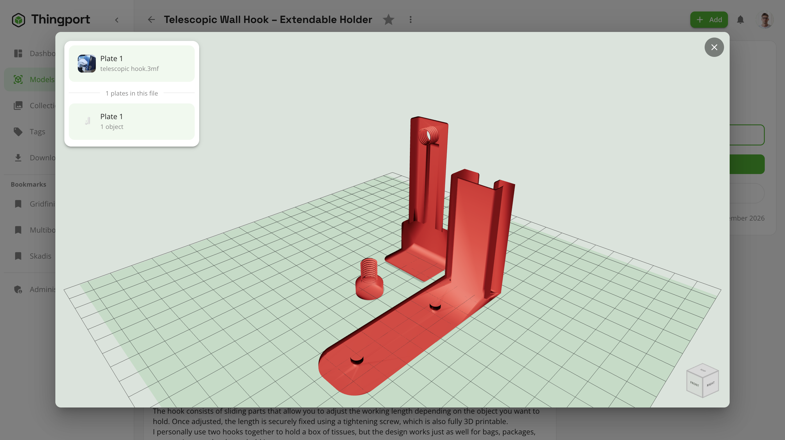</a><br><sub><b>3D Preview</b></sub></td>
    <td width="33%"><a href="frontend/src/assets/screenshots/05_collections.png" target="_blank">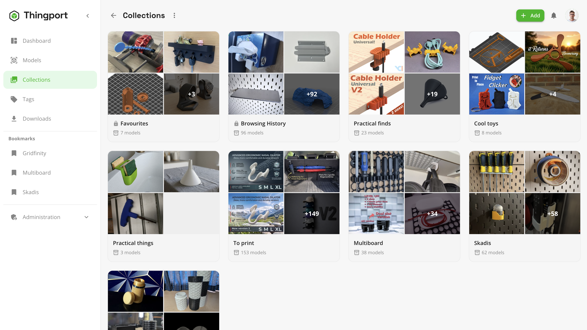</a><br><sub><b>Collections</b></sub></td>
    <td width="33%"><a href="frontend/src/assets/screenshots/06_tags.png" target="_blank">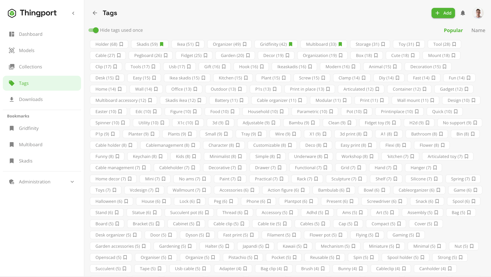</a><br><sub><b>Tags</b></sub></td>
  </tr>
  <tr>
    <td width="33%"><a href="frontend/src/assets/screenshots/07_downloads.png" target="_blank">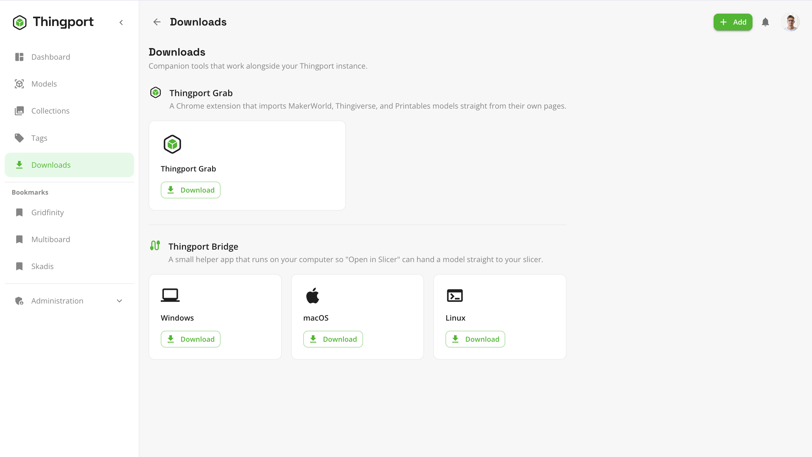</a><br><sub><b>Downloads</b></sub></td>
    <td width="33%"><a href="frontend/src/assets/screenshots/08_my_models.png" target="_blank">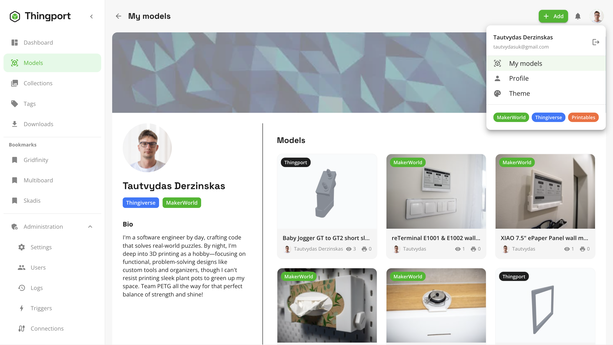</a><br><sub><b>My Models</b></sub></td>
    <td width="33%"><a href="frontend/src/assets/screenshots/09_dark_theme.png" target="_blank">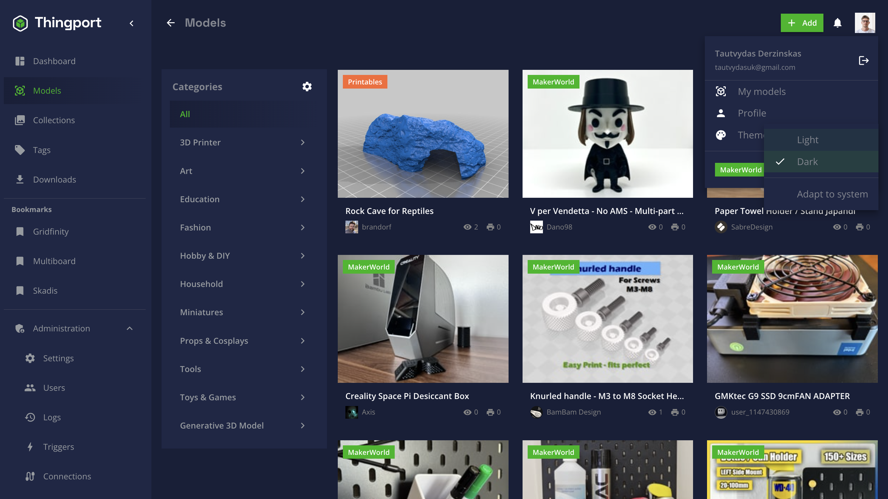</a><br><sub><b>Dark Theme</b></sub></td>
  </tr>
  <tr>
    <td width="33%"><a href="frontend/src/assets/screenshots/10_extension_printables.png" target="_blank">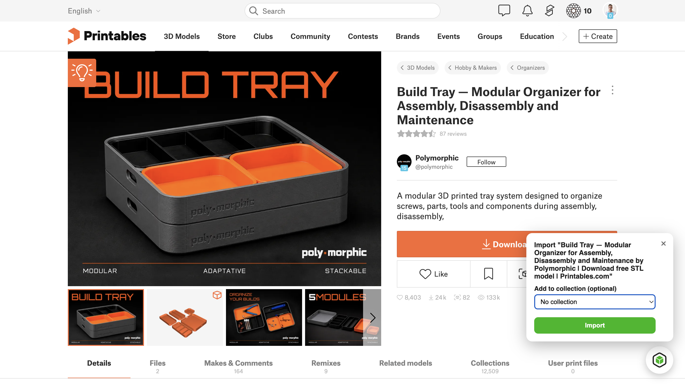</a><br><sub><b>Thingport Grab — Printables</b></sub></td>
    <td width="33%"><a href="frontend/src/assets/screenshots/11_extension_thingyverse.png" target="_blank">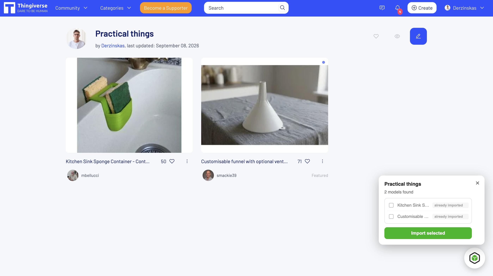</a><br><sub><b>Thingport Grab — Thingiverse</b></sub></td>
    <td width="33%"><a href="frontend/src/assets/screenshots/12_extension_makerworld.png" target="_blank">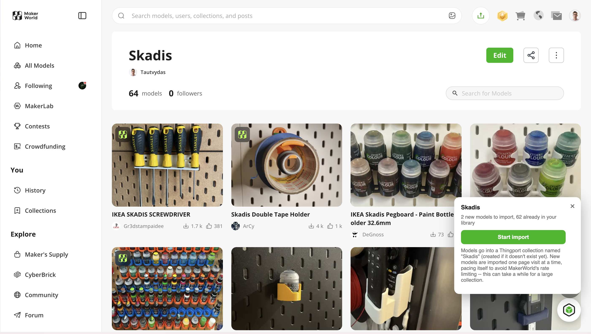</a><br><sub><b>Thingport Grab — MakerWorld</b></sub></td>
  </tr>
</table>

## Companion Apps

Thingport ships two small companion tools, each downloadable from the in-app Download page or GitHub Releases:

- **[Thingport Bridge](bridge/README.md)** — a lightweight desktop helper that makes "Open in {Slicer}" work for slicers (Bambu Studio, PrusaSlicer, Cura) whose own URL-protocol handlers won't accept a link from a self-hosted domain.
- **[Thingport Grab](extension/README.md)** — a Chrome extension that imports MakerWorld, Thingiverse, and Printables models straight from their own pages, without leaving the site (see the screenshots above).

## Provider Setup

Printables imports work with no setup. MakerWorld and Thingiverse each need a credential from your own account first -- see **[docs/PROVIDER_SETUP.md](docs/PROVIDER_SETUP.md)** for how to create a Thingiverse Access Token and how to grab a MakerWorld session cookie.

## Installation

### Docker Compose

Runs entirely from the pre-built images on GHCR -- no local build, no git clone needed. Works on any Docker host, including a NAS (Synology, QNAP, Unraid, etc).

Create a folder for Thingport and add these two files to it:

<details>
<summary><code>docker-compose.yml</code></summary>

```yaml
services:
  db:
    image: postgres:16-alpine
    restart: unless-stopped
    environment:
      - POSTGRES_USER=${POSTGRES_USER:-thingport}
      - POSTGRES_PASSWORD=${POSTGRES_PASSWORD:-thingport}
      - POSTGRES_DB=${POSTGRES_DB:-thingport}
    volumes:
      - thingport_db:/var/lib/postgresql/data
    networks:
      - app-net
    healthcheck:
      test: ["CMD-SHELL", "pg_isready -U ${POSTGRES_USER:-thingport}"]
      interval: 5s
      timeout: 5s
      retries: 10

  flaresolverr:
    image: ghcr.io/flaresolverr/flaresolverr:latest
    restart: unless-stopped
    environment:
      - LOG_LEVEL=${FLARESOLVERR_LOG_LEVEL:-info}
      - TZ=${TZ:-UTC}
    networks:
      - app-net

  backend:
    image: ghcr.io/tautvydasderzinskas/thingport-backend:latest
    restart: unless-stopped
    environment:
      - PUID=${PUID:-1000}
      - PGID=${PGID:-1000}
      - INITIAL_ADMIN_EMAIL=${INITIAL_ADMIN_EMAIL:-}
      - AUTH_SECRET=${AUTH_SECRET:-changeme-secret}
      - AUTH_TOKEN_TTL=${AUTH_TOKEN_TTL:-43200}
      - PUBLIC_URL=${PUBLIC_URL:-}
      - SMTP_HOST=${SMTP_HOST:-}
      - SMTP_PORT=${SMTP_PORT:-587}
      - SMTP_SECURE=${SMTP_SECURE:-false}
      - SMTP_USER=${SMTP_USER:-}
      - SMTP_PASS=${SMTP_PASS:-}
      - SMTP_FROM=${SMTP_FROM:-Thingport <no-reply@localhost>}
      - FILE_STORAGE=/app/storage
      - DATABASE_URL=postgresql://${POSTGRES_USER:-thingport}:${POSTGRES_PASSWORD:-thingport}@db:5432/${POSTGRES_DB:-thingport}?schema=public
      - CORS_ORIGINS=${CORS_ORIGINS:-}
      - FLARESOLVERR_URL=${FLARESOLVERR_URL:-http://flaresolverr:8191/v1}
    depends_on:
      db:
        condition: service_healthy
      flaresolverr:
        condition: service_started
    volumes:
      - thingport_storage:/app/storage
    networks:
      - app-net

  frontend:
    image: ghcr.io/tautvydasderzinskas/thingport-frontend:latest
    restart: unless-stopped
    ports:
      - "${WEB_PORT:-80}:80"
    depends_on:
      - backend
    networks:
      - app-net

volumes:
  thingport_storage:
  thingport_db:

networks:
  app-net:
    driver: bridge
```

</details>

<details>
<summary><code>.env</code></summary>

```env
# Required
# AUTH_SECRET signs login tokens -- use your own random value
AUTH_SECRET=b1193c7014e833a063f750d6e4644d615e90e6ee81dbde619e1818e9675a3374
# the first account to register with this email becomes admin
INITIAL_ADMIN_EMAIL=you@example.com
POSTGRES_PASSWORD=change-this-password

# Optional (defaults shown)
PUID=1000
PGID=1000
WEB_PORT=80
POSTGRES_USER=thingport
POSTGRES_DB=thingport
# e.g. https://thingport.example.com -- needed for links in verification emails
PUBLIC_URL=
# login token lifetime, in seconds
AUTH_TOKEN_TTL=43200
SMTP_HOST=
SMTP_PORT=587
SMTP_SECURE=false
SMTP_USER=
SMTP_PASS=
SMTP_FROM=Thingport <no-reply@localhost>
FLARESOLVERR_URL=http://flaresolverr:8191/v1
TZ=UTC
```

</details>

Then start it:

```bash
docker compose up -d
```

Thingport will be available at `http://<host>:<WEB_PORT>` (default port 80).

<details>
<summary>Building from source instead</summary>

```bash
git clone https://github.com/TautvydasDerzinskas/Thingport.git
cd Thingport
cp .env.example .env
docker compose up -d
```

This builds the images locally rather than pulling from GHCR.

</details>

## Support

If Thingport is useful to you, consider supporting its development:

- [GitHub Sponsors](https://github.com/sponsors/TautvydasDerzinskas)
- [Buy Me a Coffee](https://buymeacoffee.com/TautvydasDerzinskas)

