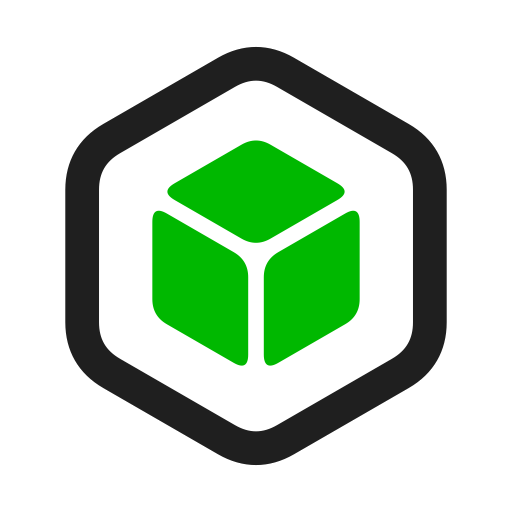

<div align="center">

</div>

# Running Thingport on TrueNAS SCALE

Thingport is a 4-container stack (Postgres, FlareSolverr, backend, frontend) that talk to
each other by container name -- the frontend's nginx config, for example, proxies `/api/*`
straight to `http://backend:8000`. There are two ways to run a multi-container stack like
this on SCALE, depending on your version:

## Option A: Custom App via YAML (SCALE 24.10 "Electric Eel" and later)

1. **Apps** -> **Discover Apps** -> **Custom App** -> **Install via YAML**.
2. Paste in [`docker-compose.yml`](docker-compose.yml) from this folder.
3. Copy [`.env.example`](.env.example) into the app's environment variables editor and
   fill in:
   - `APPDATA_PATH` -- a dataset on one of your pools, e.g. `/mnt/tank/apps/thingport`
     (replace `tank` with your actual pool name)
   - `AUTH_SECRET` -- any random string, e.g. `openssl rand -hex 32` from a terminal
   - `INITIAL_ADMIN_EMAIL` -- the email you'll register with; that account becomes admin
   - `POSTGRES_PASSWORD` -- any password
4. **Save/Install**.

If your SCALE version's Custom App form doesn't offer YAML upload, use Option B instead.

## Option B: Plain `docker compose` over SSH (any SCALE version)

1. Create a dataset for the stack, e.g. `/mnt/tank/apps/thingport`, from **Datasets** in
   the UI (or `mkdir -p` it over SSH).
2. SSH into TrueNAS and copy [`docker-compose.yml`](docker-compose.yml) and
   [`.env.example`](.env.example) into that dataset, renaming the latter to `.env` and
   filling in the same values listed in Option A above.
3. From inside the dataset folder, run:
   ```bash
   docker compose up -d
   ```

Either way, Thingport creates two folders on first start:
`$APPDATA_PATH/postgres` (database) and `$APPDATA_PATH/storage` (your imported models).
Since these live on a dataset, they're covered by whatever snapshot/replication tasks you
already have configured for that pool.

## Open it

Once all 4 containers show healthy/running, open `http://<your-truenas-ip>:<WEB_PORT>`
(default port 80).

## Notes

- **Do not rename the `backend` service/container.** The frontend's nginx config resolves
  it by that exact name over the compose network; renaming it breaks `/api/*` requests.
- If the backend can't write to `$APPDATA_PATH/storage`, check the dataset's owning
  uid/gid (`ls -n` on the parent folder) and set `PUID`/`PGID` in your `.env` to match.
- Provider setup (MakerWorld / Thingiverse credentials) works the same as any other install
  -- see [`docs/PROVIDER_SETUP.md`](../../PROVIDER_SETUP.md) in the main repo.
- To pin a specific build instead of `:latest`, see the tagging note in
  [`docker-compose.deploy.yml`](../../../docker-compose.deploy.yml) and set `BACKEND_IMAGE`/
  `FRONTEND_IMAGE` accordingly (add those two env vars to the stack and swap the `image:`
  lines to `${BACKEND_IMAGE:-...}` / `${FRONTEND_IMAGE:-...}` if you want that flexibility).
